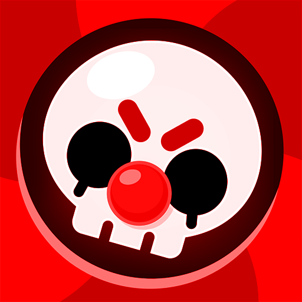

# SteelBrawl Website



Официальный сайт приватного сервера Steel Brawl. Запуск был сделан на nodejs винтом.

## Установка и запуск

1. Убедитесь, что у вас установлен Node.js (версия 14+)
2. Устоновите:
   ```bash
   git clone https://github.com/thevintdev/steelbrawl-site
   cd path
   node index.js
   ```
